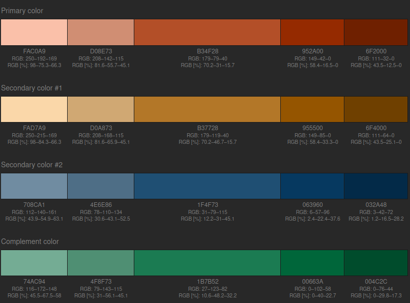

<h1 align="center">
  AIR4Children Website
</h1>

This website made usage of [Node.js](https://nodejs.org/en/), npm and [Gatsby.js](https://www.gatsbyjs.org/) and other open-sourced software tools.

## Prerequisites
1. Have a linux distribution. These instructions work fine for Ubuntu 20.04 but for Windows or Mac it should be the same with slight variations when installing the prerequisites
1. Install `node` and `npm`
  * `sudo apt install npm`
  * `npm -v` or `npm –version`
1. Install Gatsby CLI (gatsby-cli) installed globally by running:
   `npm install -g gatsby-cli`
1. Clone this repository   
   `git clone https://github.com/air4children/site`
1. Your favorite text editor (e.g. [VSCode](https://code.visualstudio.com/) , [atom](https://atom.io), [pycharm](https://www.jetbrains.com/pycharm/), etc).

## Usage
This is a Gatsby.js web development. In order to run this code you have to follow these instructions:

1. `npm install`
1. `npm run develop`
1. Open http://localhost:8000/


## Translations

We are using [linguiJs](https://lingui.js.org/tutorials/setup-cra.html) for internationalization feature. If you want to contribute making text translations between English and Spanish, please perform the following command `npm run extract`. This will check all text labels and give you the catalog text statistics:

```bash
$ npm run extract

Catalog statistics:
┌─────────────┬─────────────┬─────────┐
│ Language    │ Total count │ Missing │
├─────────────┼─────────────┼─────────┤
│ en (source) │     30      │    -    │
│ es          │     30      │    4    │
└─────────────┴─────────────┴─────────┘
```

> Please note that English is set as default locale catalog. This means it will show the texts in english when other locale labels are not added.

At the end, just run this command to compile all text label into the existent catalogs.

```
$ npm run compile

Compiling message catalogs…
Done!
```

### Gatsby plugins
1. `npm i gatsby-transformer-sharp gatsby-plugin-sharp gatsby-background-image`
1. `npm i gatsby-image`
1. `npm i gatsby-remark-images`
1. `npm i gatsby-plugin-webpack-bundle-analyzer`
1. `npm install gh-pages --save-dev`


### Website color code

Here's an image of the scheme color used in this website:


